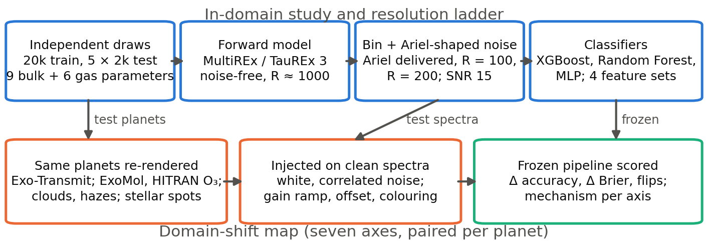
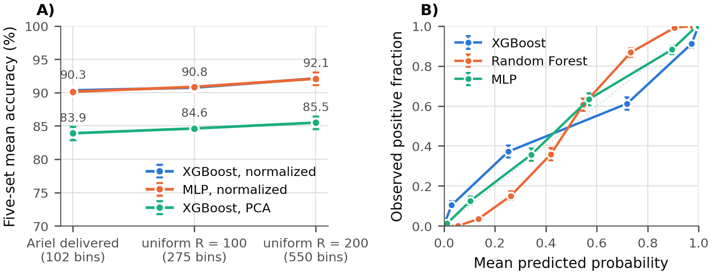
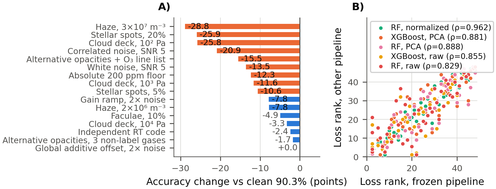
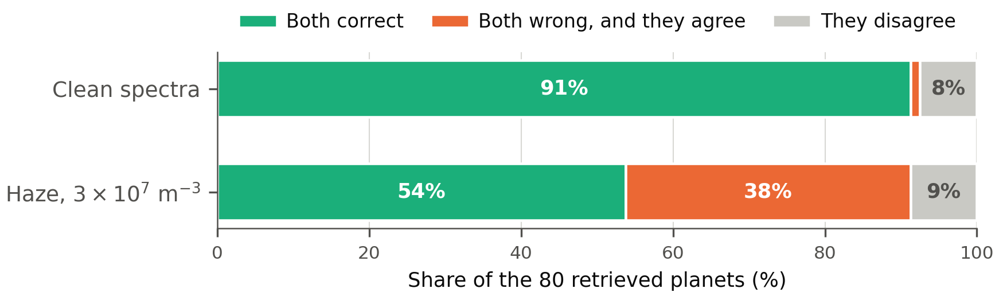

<!--
NHSJS manuscript source (paper 1). Build with build_docx.py.
Citations: [n] in first-mention order; the builder renumbers and formats.
Placeholders {{...}} are filled from v2/results/ by fill_numbers.py; none may remain at build time.
Figures: v2/results/figures/fig{1..5}_*.png. Captions use the template's "Figure N | one-line." form.
-->

# An assessment of simulator dependence in machine-learning triage of Ariel-like exoplanet transmission spectra

**Authors and affiliations:** *(omitted in the blind-review version)*

**Abstract:** Machine-learning screens are proposed to choose which exoplanets the Ariel mission studies in detail, but they are trained and tested inside a single simulator, so one can look accurate while depending on the simulator's assumptions rather than on real physics. To find out which assumptions matter, a screen was rebuilt at the layout and noise Ariel will deliver, then frozen and re-scored on the same planets re-rendered with one simulator ingredient changed at a time. The costs sorted by mechanism, not by how large a change looked. Substituting the radiative-transfer code or the line lists of non-label gases cost under 3 accuracy points, whereas anything that altered the shape of the spectrum, such as haze, cloud or stellar spots, cost 15 to 29. Those shape changes are transformations that leave the distinguishing information intact, so retraining on them recovered 79 to 89 percent of the loss; random noise, redrawn for every spectrum, returned only a third. Is that a weakness of machine learning in particular? Eighty planets were also analysed by nested-sampling retrieval, which fared no better: under a haze it did not model, its accuracy fell from 95 to 55 percent against the classifier's 95 to 61. More telling, the two agreed as often as they had on clean spectra, and two in five of those agreements were now wrong. They share a forward model and fail on the same planets, so agreement between a fast method and a slow one is no evidence that either is right.

**Keywords:** exoplanet atmospheres, transmission spectroscopy, machine learning, domain shift, data augmentation, probability calibration, Ariel

## Introduction

### Background and context

More than 6,000 exoplanets are now confirmed, and characterizing their atmospheres has become a central problem of observational astrobiology [14]. The European Space Agency's Ariel mission, due to launch in 2029, will survey the atmospheres of roughly 1,000 transiting planets with photometry and low- to medium-resolution spectroscopy between 0.5 and 7.8 µm [4, 15]. It will observe in three tiers. A broad reconnaissance survey comes first, then a deeper chemical survey of hundreds of planets, and finally a Tier 3 sample of 50 to 100 planets observed at the native resolution of the instruments [4, 5]. Between one in twenty and one in ten surveyed targets therefore reaches Tier 3, and fewer still receive phase curves or full Bayesian atmospheric retrievals. The ranking that decides which planets advance is a mission-level bottleneck, and machine-learning classifiers trained on synthetic spectra have been proposed as fast triage filters for it [1, 16].

The labelling chemistry follows Duque-Castaño et al. [1]: the co-occurrence of methane and ozone, a pair discussed as a disequilibrium biosignature [23, 25] but whose interpretation needs planetary context a transmission spectrum cannot supply, and both members of which have abiotic sources [24]. Here it serves only as a well-posed two-molecule labelling task over a broad population of warm, hydrogen-dominated planets.

### Problem statement and rationale

Published machine-learning screens of synthetic transmission spectra share three idealizations. They report accuracy on spectra from the same simulator that produced the training data; they work at resolving powers well above what the mission will deliver in the channels that matter, or at a single resolution across the band; and they score against labels that are a deterministic function of the abundances the simulator was given [1, 16, 26]. Simulation-trained models are known to degrade when the data they meet differ from the data they learned from, both in the machine-learning literature [18] and in astronomical applications [19]. Vision research answers this with corruption benchmarks, which score one frozen model across a catalogue of named corruptions at graded severities and report the resulting ranking [32]. An earlier version of this work found that a classifier trained at R = 200 lost between 4 and 26 accuracy points depending on which simulator ingredient was changed, but it drew its parameters through the simulator's own sampler, which returned radius, stellar temperature and orbital distance almost perfectly correlated, so six planetary and stellar parameters explored about three independent directions. That coupling was disclosed rather than fixed, and it is removed here. What no study has yet reported for transmission spectra is a ranked account of those sensitivities at the resolution and noise the mission will actually provide, on a grid whose parameters are sampled independently of one another.

### Significance and purpose

Anyone training a screen on simulated spectra has finite effort to spend on realism and must decide where to spend it. This study measures where that effort is repaid, and then asks what that measurement is worth to anyone else.

One method does all of this work. The same planets are re-rendered with a single ingredient of the simulator changed at a time, so every cost is a within-planet difference attributable to a named decision instead of a vague distribution gap. That yields a fidelity budget, meaning a ranked account of what each simulator choice costs the classifier. The Results then take away, one at a time, the things that dependence could otherwise be blamed on. Could it simply be trained away? Partly, and a rule says which entries and why. Is it a fact about this particular pipeline? A balanced grid of six pipelines says no. Is it a fact about machine learning at all? A full Bayesian retrieval, which does not learn and shares nothing with the classifier but the forward model, says no. What is left is the simulator itself. That carries a practical consequence, because a dependence living in the simulator cannot be found by comparing two methods built on it.

### Objectives

The research question has three parts. At Ariel's delivered resolution and noise, which of a simulator's choices does a synthetic-trained screen's reliability actually depend on; is that dependence a property of the task, so that one study's answer serves everyone, or of the pipeline, so that every group must measure its own; and would the established method of the field, a full Bayesian retrieval, have caught what the screen misses? Seven hypotheses were stated before the experiments were run, numbered in the order the Results address them. The third part of the question was added once the budget had been measured, and is stated below as H8.

1. **H1.** Tree ensembles will out-perform and out-calibrate a multilayer perceptron, and preprocessing will matter less than at R = 200 because the feature count is small.
2. **H2.** Accuracy will fall monotonically from R = 200 to the delivered configuration, with the largest step at the last rung.
3. **H3.** Errors will concentrate near the labelling thresholds, and moving both thresholds by half a dex, that is, by a factor of about three in abundance, will change accuracy by only a few points.
4. **H4.** Under each shift axis, accuracy will fall smoothly instead of collapsing.
5. **H5.** The axes will not cost equally. Molecular line-list data and correlated noise will cost more than the choice of radiative-transfer implementation or the colouring of instrument noise.
6. **H6.** Calibration and a fixed threshold will degrade under shift faster than ranking accuracy does.
7. **H7.** The ordering of those costs will be a property of the task, so that a balanced grid of two model families crossed with three feature representations will agree on it.
8. **H8.** A full retrieval, which fits a physical model to each spectrum instead of learning a decision boundary, will be less disturbed by an unmodelled ingredient than the classifier is.

### Scope and limitations

The scope is a triage classifier, not a detector. Because the labels are computed from the abundances supplied to the forward model, the task is recovery of a labelling convention from spectra, not inference of abundances from observations. The latter is what Ariel will require, through retrieval, with its attendant degeneracies and abiotic alternatives. The two are nonetheless compared directly here, on eighty planets analysed both ways.

Three properties of the grid must be stated plainly. It is a stress-test box and not an astrophysical population. Bulk parameters are drawn independently across their ranges, which keeps the sensitivity measurements clean but leaves no main sequence and no mass-radius relation. The positive class is a spectral construct, not an observable one, because in a hydrogen-dominated atmosphere between 500 and 2,500 K ozone at these abundances is thermochemically forbidden; the label remains a well-defined mapping from abundance to spectrum, which is all this study asks of it, but it is not a planet Ariel could find. And the grid has no habitable-zone analogues and no photochemistry.

The forward model is idealized in ways the shift map does not test. Atmospheres are isothermal, the fill gas is pure hydrogen, and collision-induced absorption is absent, which removes the dominant continuum opacity of a real hydrogen atmosphere. Everything is synthetic, so the results bound what a simulator-trained tool can be expected to do before real Ariel data exist to test it.

## Methods

### Research design

This is a computational, simulation-based study with three parts (Figure 1). The first is a comparative in-domain study, meaning that training and test spectra come from the same simulator settings: three classifier families are tuned and evaluated on synthetic transmission spectra at the spectral configuration Ariel is expected to deliver for its Tier 3 targets. The second is a resolution ladder. The same pipeline is retrained on the same planets at two idealized configurations, uniform resolving powers of R = 100 and R = 200, to measure what those idealizations are worth. The third is a domain-shift map, for which the pipeline that performed best in domain is frozen, meaning trained once on clean spectra and never retrained, and then scored for accuracy and probability quality on the same test planets after seven controlled changes to how the spectra were produced. Because each shifted spectrum has a clean counterpart for the identical planet, every degradation is a within-planet difference and carries no sampling confound.

**Figure 1 | Study design.** Top row: the in-domain study. Planetary, stellar and atmospheric parameters are drawn independently, forward-modelled once at native resolution without noise, binned to each observing configuration, given Ariel-shaped noise, and used to tune and compare three classifier families on four feature sets. Bottom row: the domain-shift map. The same test planets are re-rendered under changed physics, or the clean test spectra are perturbed, and the frozen best pipeline is scored on the result, so every comparison is paired at the planet level.

### Sample

The sample is a grid of 18,156 training planets and five independent test sets of 1,813, 1,822, 1,823, 1,793 and 1,821 planets, all with hydrogen-dominated atmospheres, drawn from the parameter ranges in Table 1, which were informed by the Ariel target samples [15, 17]. Every parameter was drawn independently with a NumPy random generator and passed to the forward model as a scalar. This differs from the previous version of this dataset, in which ranges were passed to the simulator's own sampler and the delivered planet radius, stellar temperature and semi-major axis were nearly collinear (Pearson r ≥ 0.97). In the present grid the largest correlation between any two bulk parameters of the delivered sample is |r| = 0.07; the only structured correlation is the intended one between the two label-defining gases (r = 0.18), which the stratified class design creates.

Class balance was enforced by the same four-profile design as before. Half of the planets were drawn with methane above 10⁻⁶ and ozone above 10⁻⁷, and one sixth each with only methane above its threshold, only ozone above its threshold, or neither. A spectrum is labelled positive if and only if both gases are above their thresholds, so the label is a deterministic function of the injected abundances. Planets whose forward model failed or returned a transit depth above unity were removed; 91 percent of the draws survived, with the losses concentrated at the lowest masses, where a hydrogen envelope on a light planet is unphysically extended (the lowest mass decile kept 50 percent of its draws, every other decile at least 87 percent).

**Table 1 | Sampling ranges for the synthetic grid.** Bulk parameters are uniform, gas abundances log-uniform. CH₄ and O₃ ranges are set per class profile as described in the text.

| Parameter | Range |
| :-- | :-- |
| Planet radius, mass | 1–26 R⊕, 1–300 M⊕ |
| Atmosphere: temperature, base and top pressure | 500–2500 K, 10⁵–10⁶ Pa, 1–10 Pa |
| Star: temperature, radius, mass | 2500–7500 K, 0.1–1.7 R☉, 0.1–1.7 M☉ |
| Semi-major axis | 0.01–0.5 AU |
| log H₂O; log CO, CO₂, NH₃ | −10 to −1; −9 to −3 |
| log CH₄; log O₃ (by class profile) | −9 to −3; −10 to −1 |

### Data collection

Transmission spectra were computed with MultiREx [1], a Python front end to the TauREx 3 radiative-transfer code [2], using an isothermal atmosphere of 100 layers, the code's default, molecular absorption from the Exo-Transmit opacity compilation [3] for H₂O, CH₄, CO₂ and O₃, and Rayleigh scattering. CO and NH₃ carry no opacity in these tables and act only through the mean molecular weight; collision-induced absorption is not included, which is one of the simulator-specific choices the domain-shift map exists to expose. Each planet was modelled once, without noise, on TauREx's native wavelength grid (2,753 points between 0.5 and 7.8 µm, a resolving power of about 1,000).

Every observing configuration was then produced by binning that native spectrum. The primary configuration is Ariel's delivered Tier 3 layout [4, 5]: three photometric bands below 1.1 µm (0.50–0.60, 0.60–0.80 and 0.80–1.10 µm), the NIRSpec channel at R = 15 over 1.10–1.95 µm, AIRS channel 0 at R = 100 over 1.95–3.90 µm and AIRS channel 1 at R = 30 over 3.90–7.80 µm, 102 bins in total. Two idealized comparators were binned from the same native spectra, a uniform R = 100 grid (275 bins) and the 550-point R ≈ 200 grid of the earlier version of this study. Binning is the exact integral of the piecewise-linear native spectrum over each bin, so it does not depend on where native points fall relative to bin edges.

Noise follows the earlier study's convention, in which the per-spectrum standard deviation is the peak-to-peak amplitude divided by a signal-to-noise ratio of 15. New here is its wavelength dependence, scaled by the noise-to-signal shape computed for the star's temperature with ExoRad 2 [6], an open radiometric model driven by an Ariel payload reconstructed from published parameters, normalized so the median per-bin value matches that convention. Realizations are drawn once per spectrum from a fixed seed, so every script scores identical test spectra and each shifted spectrum carries its clean counterpart's realization.

The peak-to-peak convention has one consequence that must be stated. Because the noise scales with each planet's own feature amplitude, every planet is observed at the same effective signal-to-noise ratio, however faint its features. Real noise is set by the star and the instrument, not by the planet. To measure what that idealization is worth, the whole in-domain study was repeated under an absolute convention, in which the median per-bin noise is a fixed 50 parts per million of transit depth with the same wavelength shape, and the frozen primary pipeline was also scored on spectra with absolute floors of 20 to 200 parts per million.

### Variables and measurements

The outcome variable is the binary CH₄–O₃ co-abundance label defined above. The predictors are the binned transit depths, prepared in one of four ways, each fitted on the training set only: raw bins standardized per bin; per-bin standardization followed by principal component analysis retaining 99.99 percent of the variance (76 components at the Ariel configuration); the same components standardized again, the whitening step the earlier study found necessary for neural networks; and per-spectrum normalization, in which each spectrum is first reduced to zero mean and unit standard deviation across its bins and then standardized per bin. The last removes each planet's absolute transit depth and feature amplitude and keeps only the shape of the spectrum.

Performance was measured on each of the five test sets and reported as mean and standard deviation across sets: accuracy, precision, recall and F1 at a decision threshold of 0.5; the Brier score [20]; the expected calibration error, computed with ten equal-count bins because tree-ensemble probabilities are strongly bimodal; and the area under the receiver operating characteristic curve. Feature amplitude, used in the error analysis, is the standard deviation of a planet's noise-free binned depths across bins, and the amplitude-to-noise ratio divides it by the planet's median per-bin noise.

### Procedure

Three classifier families were compared: gradient-boosted decision trees (XGBoost [7]), a Random Forest [8], and a multilayer perceptron with batch normalization, dropout and early stopping. The tree models were tuned on each of the raw, principal-component and per-spectrum-normalized feature sets by exhaustive five-fold cross-validated grid search on the training set (24 XGBoost and 12 Random Forest configurations per feature set); the perceptron was tuned over hidden-layer widths and dropout on the per-spectrum-normalized, whitened and unwhitened feature sets and trained from five seeds at the primary configuration and three at each comparator, with the mean reported. The tuned configurations are listed in the repository. Models were implemented with scikit-learn, XGBoost and TensorFlow [9]. Pairwise differences between models were tested with exact McNemar tests [21] on the pooled test planets and with a paired bootstrap [22] of 10,000 resamples on the F1 gap between the two best models.

### Data analysis

The resolution ladder retrained the best pipeline with its Ariel-configuration hyperparameters at each comparator configuration on the same planets, so the only change between rungs is the binning.

The label analysis moved both abundance thresholds together by up to half a dex, relabelled the unchanged spectra and retrained the model, to measure how far the result depends on the particular cutoffs; and binned the test planets by their margin, the distance in dex to the nearest label flip, to locate where errors occur.

The domain-shift map has seven axes. Four re-render the test planets from their recorded parameters with one ingredient changed: an independent radiative-transfer code (Exo-Transmit [3], with opacity tables, absorbers, layering and radius convention held fixed); alternative opacities (ExoMolOP [10] for H₂O, CH₄ and CO₂, and in a second variant a HITRAN-derived ozone table as well); grey cloud decks at five pressures and Mie hazes at five densities [11]; and stellar contamination from unocculted spots and faculae through the transit light source effect [12], computed with BT-Settl PHOENIX spectra [13] at 2 to 20 percent spot coverage. Two axes perturb the clean spectra instead of re-rendering them. The fifth is instrument noise, swept from an effective signal-to-noise ratio of 12 down to 5 in white and correlated forms and compared Ariel-coloured against white at matched median; the sixth is systematics, a multiplicative gain ramp with additive offsets both global and per-channel. The seventh retrains on planets below 15 Earth radii and tests on larger ones, against a control that differs only in its training draw. Elsewhere the pipeline is untouched and only the evaluation data changes. Absolute noise floors form an eighth, injected family. Each case reports the change in accuracy and Brier score against the paired clean baseline, the predicted-positive rate, prediction flips in each direction, and the median noise-free feature amplitude.

### Ethical considerations

The study uses simulated data only; no human participants, animal subjects or personal data are involved, and institutional review was not applicable.

### Data and code availability

Every number, table and figure in this paper is reproducible from a public repository at https://github.com/oy2017/BioSignatureDetectionModel. All code for this study is in its `v2/` directory, and `v2/REPRODUCE.md` maps each claim to the command that produces it and to the committed result file it is read from. The spectral grids are regenerated by one command; the trained models, the result files behind every number, and the figure scripts are committed, so a reader can check any value without rerunning the forward model. The simulation stack itself is open source: MultiREx [1], TauREx 3 [2], Exo-Transmit [3], the ExoMolOP tables [10], ExoRad 2 [6] and the BT-Settl/PHOENIX stellar atlas [13].

## Results

### In-domain performance, and what it should be measured against

Table 2 compares three classifier families on four feature sets. The preprocessing choice, not the model family, dominates. Per-spectrum normalization lifts XGBoost from 72.6 percent on raw bins and 83.9 percent on principal components to 90.3 percent, and lifts the multilayer perceptron from 73.6 percent on whitened components to 90.1 percent. With normalized features the three families fall within 1.3 points of one another. XGBoost leads the perceptron by 0.19 points, which the data do not resolve. The paired bootstrap puts the F1 gap at 0.5 points with a 95 percent interval of −0.0 to 1.0, so the comparison is consistent with anything from parity to a one-point advantage. Both lead the Random Forest (p = 1.4 × 10⁻⁷ and p = 2.5 × 10⁻⁴). Calibration orders the models differently from accuracy. The perceptron's expected calibration error is 0.012 against 0.038 for XGBoost and 0.064 for the Random Forest, while its Brier score matches XGBoost's to within 0.002. XGBoost on normalized features was frozen as the primary pipeline; because the two leaders are statistically tied, the shift map was repeated for five further pipelines, which settles below whether that choice matters.

Two floors say what 90 percent is worth. A logistic regression on the same normalized bins reaches 85.4 ± 0.4 percent, so gradient boosting buys 4.9 points over a linear model. A hand-built two-band index, using the windows most correlated with each gas and cutoffs tuned on the training set, reaches 74.8 ± 1.0 percent. That ordering is informative. The representation is worth more than the model, and the model is worth more than a textbook spectral index.

**Table 2 | Model and preprocessing comparison at the Ariel configuration.** Five-set mean ± standard deviation. Feature dimensions: raw and normalized 102, principal components 76. Perceptron rows are means over five training seeds. The five-set spread measures test-sample scatter; the training draw contributes a further ± 0.15 points, measured by retraining on ten bootstrap resamples.

| Model, features | Accuracy (%) | F1 (%) | Brier | ECE | AUC |
| :-- | --: | --: | --: | --: | --: |
| XGBoost, per-spectrum normalized | 90.3 ± 0.4 | 90.3 ± 0.4 | 0.069 | 0.038 | 0.975 |
| MLP, per-spectrum normalized | 90.1 ± 0.3 | 89.9 ± 0.4 | 0.067 | 0.012 | 0.973 |
| Random Forest, per-spectrum normalized | 89.1 ± 0.4 | 88.9 ± 0.4 | 0.080 | 0.064 | 0.967 |
| XGBoost, PCA | 83.9 ± 1.0 | 84.0 ± 1.1 | 0.119 | 0.064 | 0.925 |
| Random Forest, PCA | 80.7 ± 1.1 | 80.9 ± 1.1 | 0.156 | 0.141 | 0.894 |
| MLP, PCA whitened | 73.6 ± 0.8 | 77.7 ± 0.5 | 0.166 | 0.115 | 0.871 |
| MLP, PCA unwhitened | 73.7 ± 0.9 | 77.3 ± 0.7 | 0.163 | 0.111 | 0.876 |
| XGBoost, raw bins | 72.6 ± 0.5 | 73.4 ± 0.8 | 0.181 | 0.062 | 0.812 |
| Random Forest, raw bins | 72.2 ± 1.0 | 73.3 ± 0.7 | 0.187 | 0.058 | 0.799 |
| Logistic regression, per-spectrum normalized | 85.4 ± 0.4 | — | — | — | — |
| Two-band index, tuned cutoffs | 74.8 ± 1.0 | — | — | — | — |

Under the absolute-noise convention the same feature-set ordering holds at a lower level, though the two runners-up swap. Normalized XGBoost reaches 87.0 ± 0.4 percent, the Random Forest 85.9 and the perceptron 85.5, while principal components and raw bins reach 81.9 and 73.2. The frozen pipeline, scored without retraining on spectra with absolute floors of 20, 50, 100 and 200 parts per million, loses 3.3, 6.2, 8.7 and 12.3 points; retraining under the 50 ppm convention recovers about three of the six.

The grid spans transit depths and feature amplitudes far wider than Ariel's real targets. Restricted to the 22 percent of test planets whose mean depth is below 3 percent and whose peak-to-peak amplitude is below 300 parts per million, which is the range of plausible targets, the frozen pipeline reaches 89.8 ± 0.9 percent against 90.3 on the full sets. The headline is therefore not an artifact of implausibly strong signals.

Per-spectrum normalization discards each planet's absolute transit depth, so its value should track how widely depth varies across the population, and it does. Retrained on radius-restricted bands with the training-set size held fixed, the advantage over raw bins follows the spread of absolute depth: 19.3 points across 12 to 20 Earth radii, where depth spans 2.31 dex; 24.8 points across 6 to 12 radii and 2.91 dex; 31.0 points across 1 to 6 radii and 4.35 dex. The gain never vanishes, so depth heterogeneity explains part of the effect and not all of it, but a survey of a narrow planet class should expect less from this step than a heterogeneous survey does.

### Resolution ladder

Figure 2A gives the same pipelines retrained at two idealized configurations, and the ladder is nearly flat. Normalized XGBoost reaches 90.3 percent at the delivered configuration, 90.8 at uniform R = 100 and 92.1 at uniform R = 200, with the perceptron and the principal-component pipeline following the same shallow slope. Moving from the earlier study's uniform R = 200 grid to the delivered layout costs 1.8 points in total. Two qualifications push the same way. The rungs reuse hyperparameters tuned at the delivered configuration, and per-bin noise is held to one convention at every rung rather than scaled with resolving power, so 1.8 points is an upper bound on what coarse binning costs. That the ladder is flat is itself useful, because the budget measured below is then not an artifact of the delivered layout and applies to the idealized grids earlier work used.

**Figure 2 | Resolution ladder and calibration.** A) Five-set mean accuracy of three pipelines retrained at the delivered Ariel configuration and at two idealized uniform grids; error bars are standard deviations across the five test sets. B) Reliability curves of the three normalized-feature models, pooled over 9,072 test planets in ten equal-count bins with 95 percent Wilson intervals; the dotted diagonal is perfect calibration.

### Label sensitivity and error structure

Errors are located as follows. Moving both abundance thresholds together by −0.5 to +0.5 dex, relabelling the unchanged spectra and retraining, changes accuracy from 89.5 to 91.6 percent; the majority-class baseline moves much further, from 50 to 62 percent, so the 30 to 40 point advantage over that baseline is the meaningful comparison. Against the margin to the nearest label flip, accuracy is 65.5 percent for the 818 planets within 0.25 dex of a threshold, below that bin's 67.7 percent majority baseline, with a mean predicted probability of 0.58; it rises to 80.2 percent between 0.25 and 0.5 dex and to 94.9 to 96.0 percent beyond 1 dex. Those 818 planets are 9 percent of the test sets, and the classifier recovers no information on them, correctly reporting probabilities near one half.

### The fidelity budget

Table 3 and Figure 3A give the frozen pipeline's behaviour on the same test planets under each change, against its paired clean baseline of 90.33 percent. Noise is drawn from the clean spectrum's level in every case, so a suppressed atmosphere is not also rewarded with less noise, and every planet receives the same noise realization it received when clean.

The costs sort into three groups by mechanism. **Implementation choices are cheap.** An independent radiative-transfer code with opacities held fixed costs 2.4 points, the classifier-level price of a disagreement retrieval codes show at the parts-per-million level [30], substituting ExoMol tables for the three non-label gases costs 1.7, and the wavelength colouring of instrument noise is worth up to 1.8 points in the classifier's favour. **Changes to the label-bearing signal are expensive.** Replacing the ozone line list as well costs 15.5 points and moves the predicted-positive rate from 0.50 to 0.34, which is the signature of a shifted decision boundary, not of lost information. **Changes to spectral shape cost most.** A haze at 3 × 10⁷ particles per cubic metre costs 28.8 points while leaving 76 percent of the feature amplitude, against 11.6 for a cloud deck leaving 67 percent, because the haze imposes a wavelength-dependent slope where the deck dims uniformly. Unocculted spots cost 4.2, 10.6, 17.9 and 25.9 points at 2, 5, 10 and 20 percent coverage while barely changing amplitude; only the 2 percent case is representative of observed filling factors.

Two results bound the arbitrary choices. Correlated noise costs more than white noise at every kernel width tested, 8.0 to 11.8 points against white noise's 4.9, and the stellar cost varies only from 22.7 to 28.2 points at 20 percent coverage across the defensible range of spot contrast. Neither conclusion is an artifact of its assumption.

The two additive-offset rows should be read together. A single offset applied to a whole spectrum costs exactly nothing, which is a tautology of normalization and not a sign of robustness, while offsets drawn independently for each of Ariel's six channels cost 10.6 points at twice the noise level.

**Table 3 | The fidelity budget.** Change in accuracy and Brier score for the frozen pipeline against its paired clean baseline of 90.33 percent and 0.069, on the same 9,072 test planets, with the predicted-positive rate (clean 0.495) and the median noise-free feature amplitude relative to clean. Two rows are not against that baseline: the noise-colouring row compares two shifted cases at matched noise, and the extrapolation row retrains and is quoted against a control that differs only in its training distribution. Injected-noise rows carry a draw-to-draw uncertainty near 0.6 points. Full sweeps are in the repository.

| Axis | Case | Δ accuracy (points) | Δ Brier | Predicted positive rate | Amplitude ratio |
| :-- | :-- | --: | --: | --: | --: |
| Independent RT code | Exo-Transmit | −2.4 | +0.019 | 0.49 | 0.89 |
| Alternative opacities | ExoMol, three non-label gases | −1.7 | +0.012 | 0.54 | 0.92 |
| Alternative opacities | + HITRAN ozone | −15.5 | +0.139 | 0.34 | 0.86 |
| Cloud deck | 10⁴ Pa | −3.3 | +0.026 | 0.44 | 0.87 |
| Cloud deck | 10² Pa | −25.8 | +0.239 | 0.17 | 0.37 |
| Haze | 3 × 10⁷ m⁻³ | −28.8 | +0.283 | 0.12 | 0.76 |
| Stellar spots | 2 percent (representative) | −4.2 | +0.039 | 0.42 | 0.98 |
| Stellar spots | 20 percent (stress) | −25.9 | +0.262 | 0.16 | 1.05 |
| Correlated noise | effective SNR 8 | −10.7 | +0.095 | 0.45 | 1.00 |
| Gain ramp | 2 × noise | −7.8 | +0.075 | 0.50 | 1.04 |
| Global offset | 2 × noise | 0.0 | 0.000 | 0.50 | 1.00 |
| Per-channel offsets | 2 × noise | −10.6 | — | — | 1.00 |
| Absolute noise floor | 50 ppm | −6.2 | +0.065 | 0.41 | 1.00 |
| Noise colouring | Ariel-shaped vs white, SNR 7 | +1.6 | −0.014 | 0.45 | 1.00 |
| Extrapolation | radius > 15 R⊕, vs matched control | −6.2 | +0.046 | — | — |

Two caveats on the aerosol rows. The haze is uniformly mixed through the whole atmospheric column, whereas a photochemical haze is confined to low pressures, so those rows are upper bounds on chromatic aerosol distortion. And out-of-envelope extrapolation costs 6.2 points. An intermediate version of this analysis put it near zero because it resampled the test planets as well as the training set, and large planets are intrinsically easier, so an easier control masked the penalty.

**Figure 3 | The fidelity budget and whether it transfers.** A) Accuracy change of the frozen pipeline on the same test planets under each controlled change, sorted; orange bars exceed ten points. B) All 48 shifted cases scored with five further pipelines, plotted as the rank of each loss against its rank for the frozen pipeline, with the Spearman correlation of each series. Points on the diagonal mean the two pipelines agree about which changes matter most.

### Which losses can be repaired

A budget that only diagnoses is of limited use. The pipeline was retrained on training sets carrying the same physics (Table 4), with each planet assigned a random strength and a third left clean, the procedure known as domain randomization [29], and scored on the identical shifted test planets.

**Table 4 | Recovery by training on the shifted physics.** The last column is the recovered fraction of the gap between the frozen pipeline's shifted accuracy and its clean 90.3 percent. Cases are those costing the frozen pipeline more than five points, where the gap is wide enough for a recovered fraction to be meaningful; the weaker settings of each axis are discussed in the text.

| Axis | Case | Frozen (%) | Augmented (%) | Gain (points) | Gap recovered |
| :-- | :-- | --: | --: | --: | --: |
| Stellar spots | 5 percent | 79.7 | 88.1 | +8.4 | 79 percent |
| Stellar spots | 20 percent | 64.4 | 85.3 | +20.8 | 80 percent |
| Haze | 3 × 10⁷ m⁻³ | 61.5 | 87.2 | +25.7 | 89 percent |
| Haze | 2.4 × 10⁸ m⁻³ | 52.5 | 84.0 | +31.4 | 83 percent |
| Correlated noise | effective SNR 10 | 84.0 | 86.0 | +2.0 | 31 percent |
| Correlated noise | effective SNR 8 | 79.8 | 83.6 | +3.7 | 35 percent |
| Correlated noise | effective SNR 5 | 69.0 | 75.6 | +6.6 | 31 percent |
| White noise | effective SNR 5 | 77.5 | 81.1 | +3.7 | 29 percent |
| Gain ramp | 2 × noise | 82.4 | 89.0 | +6.6 | 84 percent |

The split in Table 4 has a mechanism. Stellar contamination and haze are transformations. They map the spectrum onto a different shape while preserving the information that distinguishes the classes, and a model shown examples learns to undo them, recovering 79 to 89 percent of the loss for about 1.4 points of clean accuracy. Noise is redrawn for every spectrum. Augmentation can teach a model the distribution that noise comes from but cannot let it undo a particular draw, so it returns about a third.

The recovered fractions are smaller where the shift is mild, and the table's range should not be read as covering those. At the 2 percent spot coverage that is representative of observed filling factors, augmentation recovers 62 percent rather than four fifths, and at the weakest haze, which costs half a point to begin with, the augmented model ends up 0.8 points worse than the frozen one. White noise at effective signal-to-noise ratios of 12 and 10 returns 1 to 2 percent. A recovered fraction is only informative once there is a substantial loss to recover, which is why Table 4 is drawn from the cases that have one.

The rule as stated has an obvious weakness. Set the gain ramp aside for a moment. Of the four axes that remain, the two repairable ones are both re-rendered physics and the two unrepairable ones are both injected noise, so the comparison cannot say whether what matters is the number of values a shift draws for each spectrum or simply whether it came out of the forward model. The gain ramp settles the question. It is an instrument systematic, injected exactly as the noise is and not re-rendered, but its entire effect on a spectrum is one tilt with a sign chosen per planet. If provenance were what mattered it should behave like the noise; if the number of drawn values were what mattered it should behave like the physics. It recovers 84 percent, which places it firmly with the physics.

One further explanation had to be ruled out. A known result in machine-learning robustness is that noise augmentation helps against corruptions concentrated at high frequencies and can hurt against low-frequency ones [27], and all three repairable shifts here look smooth while both unrepairable ones look rough. Measuring where the power of each perturbation actually sits shows this is not the explanation. The correlated noise is the smoothest of the five perturbations, with 2 percent of its power above an eighth of a cycle per bin against 11 percent for the haze, and it is still the least repairable of them.

That is the repair rule, and it lets a modeller deciding where to spend effort separate the two cases. Contamination physics, however severe, can be met with augmentation. The noise budget has to be met by the observation itself.

### Does the budget transfer?

Both of the results above were measured on one pipeline, so neither says whether the dependence belongs to the task or to that pipeline. To settle it, every shift was scored again by a balanced grid of six pipelines: two model families, gradient-boosted trees and a random forest, crossed with three feature representations, per-spectrum normalization, principal components and raw bins. Balancing the grid is what makes the question answerable, because it separates the two explanations any agreement might have. If pipelines agree because they share a way of representing the spectrum, agreement should appear only between pipelines that share one. If they agree because they are all solving the same task, it should appear everywhere.

The fifteen pairs of pipelines fall into three groups (Figure 3B), and the result is clean. Pairs that share a representation agree on the ordering of the shifts at a mean rank correlation of 0.944. Pairs that share a model family agree at 0.846. Pairs that share neither also agree at 0.846, the same figure to three decimal places. Sharing an algorithm, in other words, buys nothing at all. Two pipelines built on the same model but different representations agree no better than two pipelines with nothing in common. A one-sided rank test places the representation-sharing pairs above the rest at p = 0.009. Nor is the ordering a trivial consequence of how much signal each shift removes, since ranking the shifts by their surviving feature amplitude reproduces the frozen pipeline's ordering at only 0.39. The ranges do overlap at two pairs, so this is a difference in averages, not a clean partition.

The magnitudes are a different matter, and they invert the ranking of the pipelines themselves. Under a haze at 3 × 10⁷ the frozen pipeline falls to 61.5 percent while the PCA pipeline, 6.4 points worse in-domain, holds 77.8 percent. The same inversion appears at spot coverages of 5 percent and above, and at cloud decks of 100 Pa. It does not appear at weaker shifts, where the frozen pipeline still wins, and it is not a floor effect, since both pipelines sit well above chance. Weighted over a population, the PCA representation only wins overall once about 28 percent of targets carry severe haze. The practical reading is therefore narrow. The ordering of what matters is reusable, the magnitudes are not, and the choice of representation is a bet on how contaminated the observed population will be.

### Does a full retrieval do better?

The natural objection to everything above is that a classifier is a shortcut, and that the established method of the field, Bayesian atmospheric retrieval by nested sampling, would not be fooled in the same way. Checking a fast method against that standard is not a hypothetical safeguard but the way machine-learning retrievals are normally validated: Nixon and Madhusudhan [31] assess a random-forest retrieval by how closely its posteriors reproduce nested sampling's, and Ardévol Martínez et al. [33] report that their network and nested sampling agree within 2σ on 86 percent of real observations. The same authors found that a retrieval given incorrect assumptions underestimated its own uncertainty in 12 to 41 percent of cases, against below 10 percent for the network. What nobody has asked is whether the agreement between two such methods carries any information about whether either is right. That is testable, and it was tested.

Eighty planets, forty from each class, were retrieved twice, once from their clean spectra and once from the same planets re-rendered under the haze at 3 × 10⁷ particles per cubic metre, which is the most expensive single change in the budget. Each retrieval fits seven free parameters, the four gases with opacity data, an isothermal temperature, the planet radius and a grey cloud-top pressure, so it is not handed the absence of aerosols for free. The forward model inside the retrieval is the same one that generated the spectra, which treats the retrieval far more generously than any real analysis would be treated, since the haze is the only thing it does not know about. Whatever degradation appears here is therefore a lower bound on what would happen with a real instrument and a real atmosphere.

On clean spectra the two methods are indistinguishable. Retrieval recovers the label for 95.0 percent of the eighty planets, and the frozen classifier for the same figure. Under the haze, retrieval falls to 55.0 percent and the classifier to 61.3 percent. The gap between them under the haze is not statistically significant, one planet against six on a paired exact test at p = 0.125, so the honest statement is not that the classifier is better but that the retrieval is no better, at roughly fifty minutes of computation per planet against a few milliseconds.

The more useful result is what happens to the agreement between the two methods, in Figure 4. They continue to agree with one another almost exactly as often under the haze as on clean spectra, 91.2 percent against 92.5. What changes is what that agreement is worth. On clean spectra, when the two methods agree, they are wrong about one planet in seventy. Under the haze, when they agree, they are wrong about two planets in five. The two methods do not simply both degrade. They degrade on the same planets, and in the same direction.

This matters because checking a fast method against a slow one is the ordinary way a screen like this would be validated, and on this evidence it does not work. A practitioner who ran a handful of retrievals to confirm the classifier's behaviour would come away reassured while both methods were failing together. None of this is a fault in nested sampling, which converged and returned the best account of each spectrum its forward model allowed; that model had no haze in it, and no sampler can recover what the model does not contain. What fails is the inference drawn from agreement, not the algorithm. Agreement between two methods that share a blind spot is not evidence that either is right.

**Figure 4 | A cheap method and an expensive one under an ingredient neither models.** The same 80 planets, retrieved by nested sampling and classified by the frozen pipeline, on identical spectra. The share on which the two methods disagree barely moves, from 8 to 9 percent, while the share on which they agree and are both wrong rises from 1 to 38 percent.

Three limits on this comparison should be stated. Eighty planets is a small sample, chosen because each retrieval takes the better part of an hour; the collapse from 95 to 55 percent is far too large to be a sampling artifact, but the six-point difference between the two methods under the haze could easily be one. Each retrieval was capped at 15,000 likelihood evaluations, but the cap is not what produced the failures: only two of the eighty hazed runs reached it, the median hazed run finished sooner than its clean counterpart (7,885 evaluations against 8,820), and runs that spent more evaluations were if anything likelier to be wrong (Spearman −0.35). The sampler converged. What it converged on was a misspecified model. And only one shift axis was tested this way, the most expensive one.

### Calibration, thresholds, and prevalence

Probability quality degrades faster than accuracy does, which matters because a threshold set on clean spectra is what a deployed screen would use. Under the 10⁴ Pa deck accuracy falls 3.3 points while the Brier score rises from 0.069 to 0.095 and the expected calibration error from 0.037 to 0.066; the threshold delivering 95 percent recall moves from 0.22 to 0.04. Ranking survives better than the cut point, average precision falling only from 0.977 to 0.963.

Prevalence moves the operating point further than any shift measured here. The grid is balanced by construction, so a real survey, which will be overwhelmingly negative, needs a threshold of 0.96 rather than 0.5 to hold 50 percent precision at a 1 percent base rate, and still retains 73.8 percent recall there. Precision-recall curves under shift and the full prevalence sweep are in the supporting material.

## Discussion

### Restatement of key findings

At the resolution and noise Ariel will deliver, a classifier trained on simulated spectra recovers the two-molecule label for 90 percent of held-out planets, and 89.8 percent on the subset whose depths and amplitudes resemble real targets. Preprocessing is what produced that number, far more than the choice of model. Normalization was worth 6 to 18 points, while the three model families finished within 1.3 points of one another.

Under controlled changes to the physics, the costs sort by mechanism, and how large a change looks is a poor guide to what it costs. Implementation choices are nearly free, a point or two apiece, until they touch the label-bearing molecule, which costs 15.5 points. Changes to spectral shape are the most expensive. Errors concentrate within a quarter of a dex of the labelling thresholds, and calibration and operating thresholds move under shifts that barely move accuracy.

Three results decide what that budget is worth, and the last is the most consequential. How the spectrum is represented decides which changes matter, and the model trained on it does not, since pipelines sharing only a model family agree no better than pipelines sharing nothing at all. What can be repaired is set by how many values a shift draws for each spectrum, not by where the shift came from. And a full retrieval is no safeguard against either failing. Under the haze it was the less accurate of the two, and the two went on agreeing with one another while two in five of those agreements were wrong.

### Implications and significance

The practical product is a fidelity budget with a repair rule attached. A group training a screen on simulated spectra can now separate what must be modelled correctly from what can be learned. Contamination and aerosols are transformations that training can largely undo at the severities costing most; noise, redrawn for every spectrum, cannot be undone that way. That distinction is among the most transferable things here, because it does not depend on the label, the instrument or the model family, and it says where realism effort earns its keep and where only a better observation will do.

The transferability result has two halves, and both matter. The ordering of costs is stable across a balanced grid of six pipelines, so a published budget is a usable ranking. The magnitudes are not. The same change can cost one pipeline several times what it costs another, and at strong shifts the ranking of the pipelines themselves inverts, with the representation that is worse in-domain becoming markedly better under heavy haze. That inversion does not occur at realistic shift strengths and only pays across a population if severe contamination is common, so it is not grounds for deploying the weaker model. It is grounds for treating a borrowed budget as a ranking, not as a set of numbers, and for measuring one's own if the population is expected to be contaminated.

Two results correct the earlier version of this study. Swapping the line lists of non-label gases cost 16 points there and 1.7 here, and radius extrapolation cost 8 points there and 6.2 here once the control was specified correctly.

The normalization result also explains the pipeline's failure mode. What normalization keeps is shape, so anything that recolours the spectrum, whether a haze, a stellar spot or an inter-channel offset, attacks the feature space directly. The immunity to a single global offset is a tautology of the same construction and should not be read as robustness to calibration error, because the offsets a six-channel payload actually makes are per-channel, and Table 3 prices those.

The retrieval comparison changes what a group should do about all of this. The obvious safeguard, when a fast method has been trained on simulations, is to check it against the slow method the field already trusts, and on the evidence here that safeguard does not work, because the slow method shares the blind spot. What does discriminate is the intervention itself. Re-rendering the same planets with one ingredient changed costs a fraction of what a retrieval costs and exposes precisely the dependence that agreement conceals.

### Connection to objectives

H1 was half right. Tree ensembles did not out-perform the perceptron once features were normalized, and the perceptron was the better calibrated; the clause predicting that preprocessing would matter less was wrong in the other direction, since preprocessing was the largest single effect measured. H2 was not supported, since the ladder costs 1.8 points in total and only 0.4 at the final rung. H3 was supported, with errors concentrated within 0.25 dex of the thresholds and, under the absolute noise floor, at low amplitude, and with threshold shifts of half a dex changing accuracy by 2.1 points. H4 was supported for the sweepable axes but requires one qualification. At the strongest aerosol settings the classifier saturates at the majority class instead of degrading smoothly, predicting negative for every planet under the densest haze. H5 was partly supported. Correlated noise cost more than white noise as predicted, and the radiative-transfer implementation and noise colouring cost almost nothing, but the line-list prediction held only for the molecule that defines the label, and the largest costs came from an axis the hypothesis did not name, namely chromatic distortion. H6 was supported. H7 was supported for the ordering and refuted for the magnitudes. On a balanced grid the ordering is carried by the representation and not by the model family, while the magnitudes differ enough between pipelines that a borrowed budget cannot be used as numbers. H8 was refuted, in the same direction as the one prior comparison of the two approaches under incorrect assumptions [33]. The retrieval was not less disturbed by the unmodelled haze than the classifier was; it was if anything slightly more disturbed, and it failed on the same planets.

### Recommendations

For anyone building a simulator-trained screen: normalize per spectrum unless the target population is narrow, validate against stellar contamination and aerosols before anything else, and augment the training set with those two instead of trying to model them perfectly, because they are largely learnable. Spend the saved effort on the noise budget, which is not. Set operating thresholds on the deployment distribution, and set them for the deployment prevalence, which moves the threshold further than any physics shift measured here. Treat a published fidelity budget as a ranking, not as numbers.

And do not treat agreement with a full retrieval as a validation of the screen. The two methods are built from the same physical assumptions and fail together when those assumptions are wrong, so agreement measures how much they have in common, not whether either is right. A single re-render with one ingredient changed is both cheaper and more informative.

For this line of work, three checks would strengthen any successor: a training grid drawn from an astrophysical population rather than an independent box, since failure outside the training envelope is a known weakness of supervised retrieval [31], collision-induced absorption included as an eighth shift axis, and a haze confined to the pressures where photochemistry puts one.

### Limitations

The scope limits set out at the start apply throughout: a labelling convention and not a detection, a constructed positive class, a stress-test grid, and a forward model that is isothermal, hydrogen-only and without collision-induced absorption. None of those three forward-model approximations is tested by any shift axis, and the isothermal one is known to bias abundances retrieved from such spectra by about a decade [28], so all three remain open.

Several measurements rest on adopted choices whose cost is bounded in the Results rather than eliminated: the spot contrast, the noise colouring taken from a reconstructed payload instead of the consortium's file, the correlation length of the noise kernel, and a haze mixed uniformly instead of confined to low pressure. Five-set standard deviations measure test-sample scatter only, the training draw adding ± 0.15 points, and the frozen pipeline was selected on those same test sets from two statistically tied candidates.

### Closing thought

A screen that reaches 90 percent inside its own simulator has told its users almost nothing until they know which of the simulator's choices it depends on, which of its failures they could train away, and whether any check available to them would reveal the rest. Measured at the configuration Ariel will fly, this classifier proves robust to the things a modeller usually worries about, fragile to the things an observer usually worries about, and repairable for exactly the subset of those failures that preserve information, while the check most likely to be reached for, agreement with a full retrieval, cannot help. Quantified reliability of that kind, not headline accuracy, is what should decide whether such a tool is trusted with a share of a mission's time.

## Acknowledgments

*(omitted in the blind-review version)*

## References

1. D. S. Duque-Castaño, J. I. Zuluaga, L. Flor-Torres. Machine-assisted classification of potential biosignatures in Earth-like exoplanets using low signal-to-noise ratio transmission spectra. Monthly Notices of the Royal Astronomical Society. Vol. 539, pg. 1528–1552, 2025, https://doi.org/10.1093/mnras/staf563.
2. A. F. Al-Refaie, Q. Changeat, I. P. Waldmann, G. Tinetti. TauREx 3: A fast, dynamic, and extendable framework for retrievals. The Astrophysical Journal. Vol. 917, pg. 37, 2021, https://doi.org/10.3847/1538-4357/ac0252.
3. E. M.-R. Kempton, R. Lupu, A. Owusu-Asare, P. Slough, B. Cale. Exo-Transmit: An open-source code for calculating transmission spectra for exoplanet atmospheres of varied composition. Publications of the Astronomical Society of the Pacific. Vol. 129, pg. 044402, 2017, https://doi.org/10.1088/1538-3873/aa61ef.
4. G. Tinetti, P. Drossart, P. Eccleston, P. Hartogh, A. Heske, J. Leconte, G. Micela, M. Ollivier, G. Pilbratt, L. Puig, D. Turrini, B. Vandenbussche, P. Wolkenberg, J.-P. Beaulieu, L. A. Buchave, M. Ferus, M. Griffin, M. Guedel, K. Justtanont, P.-O. Lagage, P. Machado, G. Malaguti, M. Min, H. U. Nørgaard-Nielsen, M. Rataj, T. Ray, I. Ribas, M. Swain, R. Szabo, S. Werner, J. Barstow, M. Burleigh, J. Cho, V. Coudé du Foresto, A. Coustenis, L. Decin, T. Encrenaz, M. Galand, M. Gillon, R. Helled, J. C. Morales, A. García Muñoz, A. Moneti, I. Pagano, E. Pascale, G. Piccioni, D. Pinfield, S. Sarkar, F. Selsis, J. Tennyson, A. Triaud, O. Venot, I. Waldmann, D. Waltham, G. Wright, et al. A chemical survey of exoplanets with ARIEL. Experimental Astronomy. Vol. 46, pg. 135–209, 2018, https://doi.org/10.1007/s10686-018-9598-x.
5. L. V. Mugnai, E. Pascale, B. Edwards, A. Papageorgiou, S. Sarkar. ArielRad: the Ariel radiometric model. Experimental Astronomy. Vol. 50, pg. 303–328, 2020, https://doi.org/10.1007/s10686-020-09676-7.
6. L. V. Mugnai, A. Bocchieri, E. Pascale. ExoRad 2.0: The generic point source radiometric model. Journal of Open Source Software. Vol. 8, pg. 5348, 2023, https://doi.org/10.21105/joss.05348.
7. T. Chen, C. Guestrin. XGBoost: A scalable tree boosting system. Proceedings of the 22nd ACM SIGKDD International Conference on Knowledge Discovery and Data Mining. pg. 785–794, 2016, https://doi.org/10.1145/2939672.2939785.
8. L. Breiman. Random forests. Machine Learning. Vol. 45, pg. 5–32, 2001, https://doi.org/10.1023/A:1010933404324.
9. F. Pedregosa, G. Varoquaux, A. Gramfort, V. Michel, B. Thirion, O. Grisel, M. Blondel, P. Prettenhofer, R. Weiss, V. Dubourg, J. Vanderplas, A. Passos, D. Cournapeau, M. Brucher, M. Perrot, É. Duchesnay. Scikit-learn: Machine learning in Python. Journal of Machine Learning Research. Vol. 12, pg. 2825–2830, 2011, https://www.jmlr.org/papers/v12/pedregosa11a.html.
10. K. L. Chubb, M. Rocchetto, S. N. Yurchenko, M. Min, I. Waldmann, J. K. Barstow, P. Mollière, A. F. Al-Refaie, M. W. Phillips, J. Tennyson. The ExoMolOP database: Cross sections and k-tables for molecules of interest in high-temperature exoplanet atmospheres. Astronomy & Astrophysics. Vol. 646, pg. A21, 2021, https://doi.org/10.1051/0004-6361/202038350.
11. J.-M. Lee, K. Heng, P. G. J. Irwin. Atmospheric retrieval analysis of the directly imaged exoplanet HR 8799b. The Astrophysical Journal. Vol. 778, pg. 97, 2013, https://doi.org/10.1088/0004-637X/778/2/97.
12. B. V. Rackham, D. Apai, M. S. Giampapa. The transit light source effect: False spectral features and incorrect densities for M-dwarf transiting planets. The Astrophysical Journal. Vol. 853, pg. 122, 2018, https://doi.org/10.3847/1538-4357/aaa08c.
13. F. Allard, D. Homeier, B. Freytag. Models of very-low-mass stars, brown dwarfs and exoplanets. Philosophical Transactions of the Royal Society A. Vol. 370, pg. 2765–2777, 2012, https://doi.org/10.1098/rsta.2011.0269.
14. R. L. Akeson, X. Chen, D. Ciardi, M. Crane, J. Good, M. Harbut, E. Jackson, S. R. Kane, A. C. Laity, S. Leifer, M. Lynn, D. L. McElroy, M. Papin, P. Plavchan, S. V. Ramírez, R. Rey, K. von Braun, M. Wittman, M. Abajian, B. Ali, C. Beichman, A. Beekley, G. B. Berriman, S. Berukoff, G. Bryden, B. Chan, S. Groom, C. Lau, A. N. Payne, M. Regelson, M. Saucedo, M. Schmitz, J. Stauffer, P. Wyatt, A. Zhang. The NASA Exoplanet Archive: Data and tools for exoplanet research. Publications of the Astronomical Society of the Pacific. Vol. 125, pg. 989–999, 2013, https://doi.org/10.1086/672273.
15. B. Edwards, G. Tinetti. The Ariel target list: The impact of TESS and the potential for characterizing multiple planets within a system. The Astronomical Journal. Vol. 164, pg. 15, 2022, https://doi.org/10.3847/1538-3881/ac6bf9.
16. P. Márquez-Neila, C. Fisher, R. Sznitman, K. Heng. Supervised machine learning for analysing spectra of exoplanetary atmospheres. Nature Astronomy. Vol. 2, pg. 719–724, 2018, https://doi.org/10.1038/s41550-018-0504-2.
17. Q. Changeat, K. H. Yip. ESA-Ariel Data Challenge NeurIPS 2022: Introduction to exo-atmospheric studies and presentation of the Atmospheric Big Challenge (ABC) database. RAS Techniques and Instruments. Vol. 2, pg. 45–61, 2023, https://doi.org/10.1093/rasti/rzad001.
18. Y. Ovadia, E. Fertig, J. Ren, Z. Nado, D. Sculley, S. Nowozin, J. V. Dillon, B. Lakshminarayanan, J. Snoek. Can you trust your model's uncertainty? Evaluating predictive uncertainty under dataset shift. Advances in Neural Information Processing Systems. Vol. 32, pg. 13991–14002, 2019, https://doi.org/10.48550/arXiv.1906.02530.
19. A. Ćiprijanović, D. Kafkes, K. Downey, S. Jenkins, G. N. Perdue, S. Madireddy, T. Johnston, G. F. Snyder, B. Nord. DeepMerge – II. Building robust deep learning algorithms for merging galaxy identification across domains. Monthly Notices of the Royal Astronomical Society. Vol. 506, pg. 677–691, 2021, https://doi.org/10.1093/mnras/stab1677.
20. G. W. Brier. Verification of forecasts expressed in terms of probability. Monthly Weather Review. Vol. 78, pg. 1–3, 1950, https://doi.org/10.1175/1520-0493(1950)078%3C0001:VOFEIT%3E2.0.CO;2.
21. Q. McNemar. Note on the sampling error of the difference between correlated proportions or percentages. Psychometrika. Vol. 12, pg. 153–157, 1947, https://doi.org/10.1007/BF02295996.
22. B. Efron, R. J. Tibshirani. *An introduction to the bootstrap*. Chapman & Hall, 1993, https://doi.org/10.1201/9780429246593.
23. E. W. Schwieterman, N. Y. Kiang, M. N. Parenteau, C. E. Harman, S. DasSarma, T. M. Fisher, G. N. Arney, H. E. Hartnett, C. T. Reinhard, S. L. Olson, V. S. Meadows, C. S. Cockell, S. I. Walker, J. L. Grenfell, S. Hegde, S. Rugheimer, R. Hu, T. W. Lyons. Exoplanet biosignatures: A review of remotely detectable signs of life. Astrobiology. Vol. 18, pg. 663–708, 2018, https://doi.org/10.1089/ast.2017.1729.
24. V. S. Meadows, C. T. Reinhard, G. N. Arney, M. N. Parenteau, E. W. Schwieterman, S. D. Domagal-Goldman, A. P. Lincowski, K. R. Stapelfeldt, H. Rauer, S. DasSarma, S. Hegde, N. Narita, R. Deitrick, J. Lustig-Yaeger, T. W. Lyons, N. Siegler, J. L. Grenfell. Exoplanet biosignatures: Understanding oxygen as a biosignature in the context of its environment. Astrobiology. Vol. 18, pg. 630–662, 2018, https://doi.org/10.1089/ast.2017.1727.
25. J. Krissansen-Totton, S. Olson, D. C. Catling. Disequilibrium biosignatures over Earth history and implications for detecting exoplanet life. Science Advances. Vol. 4, pg. eaao5747, 2018, https://doi.org/10.1126/sciadv.aao5747.
26. K. H. Yip, Q. Changeat, N. Nikolaou, M. Morvan, B. Edwards, I. P. Waldmann, G. Tinetti. Peeking inside the black box: Interpreting deep-learning models for exoplanet atmospheric retrievals. The Astronomical Journal. Vol. 162, pg. 195, 2021, https://doi.org/10.3847/1538-3881/ac1744.
27. D. Yin, R. Gontijo Lopes, J. Shlens, E. D. Cubuk, J. Gilmer. A Fourier perspective on model robustness in computer vision. Advances in Neural Information Processing Systems. Vol. 32, 2019, https://arxiv.org/abs/1906.08988.
28. M. Rocchetto, I. P. Waldmann, O. Venot, P.-O. Lagage, G. Tinetti. Exploring biases of atmospheric retrievals in simulated JWST transmission spectra of hot Jupiters. The Astrophysical Journal. Vol. 833, pg. 120, 2016, https://doi.org/10.3847/1538-4357/833/1/120.
29. J. Tobin, R. Fong, A. Ray, J. Schneider, W. Zaremba, P. Abbeel. Domain randomization for transferring deep neural networks from simulation to the real world. IEEE/RSJ International Conference on Intelligent Robots and Systems. pg. 23–30, 2017, https://doi.org/10.1109/IROS.2017.8202133.
30. J. K. Barstow, Q. Changeat, R. Garland, M. R. Line, M. Rocchetto, I. P. Waldmann. A comparison of exoplanet spectroscopic retrieval tools. Monthly Notices of the Royal Astronomical Society. Vol. 493, pg. 4884–4909, 2020, https://doi.org/10.1093/mnras/staa548.
31. M. C. Nixon, N. Madhusudhan. Assessment of supervised machine learning for atmospheric retrieval of exoplanets. Monthly Notices of the Royal Astronomical Society. Vol. 496, pg. 269–281, 2020, https://doi.org/10.1093/mnras/staa1150.
32. D. Hendrycks, T. Dietterich. Benchmarking neural network robustness to common corruptions and perturbations. International Conference on Learning Representations, 2019, https://arxiv.org/abs/1903.12261.
33. F. Ardévol Martínez, M. Min, I. Kamp, P. I. Palmer. Convolutional neural networks as an alternative to Bayesian retrievals for interpreting exoplanet transmission spectra. Astronomy & Astrophysics. Vol. 662, pg. A108, 2022, https://doi.org/10.1051/0004-6361/202142976.
